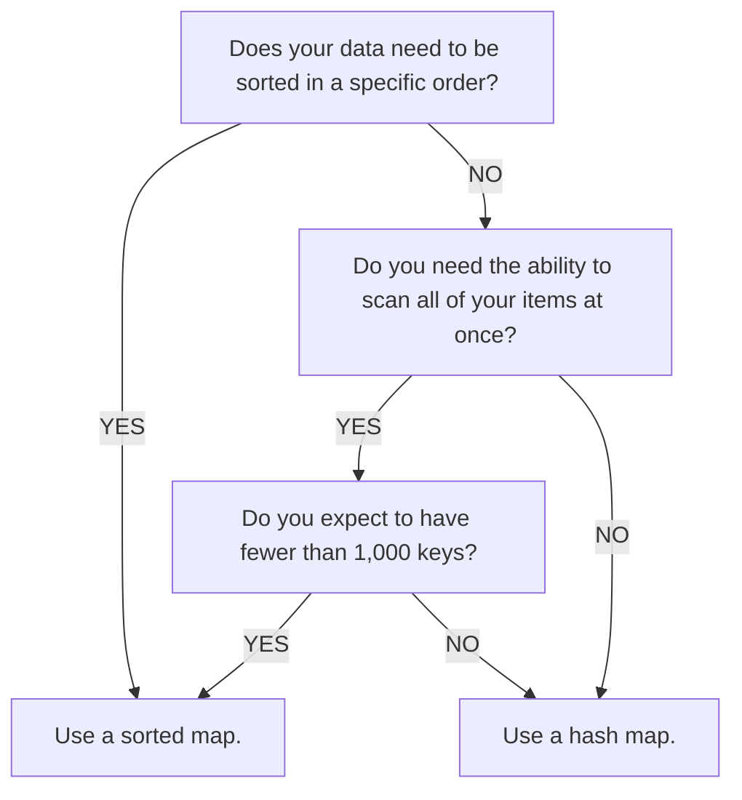

`Class.MemoryStoreService` is a high throughput and low latency data service that provides fast in-memory data storage accessible from all servers in a live session. **Memory Stores** are suitable for frequent and ephemeral data that change rapidly and don't need to be durable, because they are faster to access and vanish when reaching the maximum lifetime. For data that needs to persist across sessions, use [data stores](../../cloud-services/data-stores/index.md).

## Data structures

Instead of directly accessing raw data, memory stores have three primitive data structures shared across servers for quick processing: [sorted map](../../cloud-services/memory-stores/sorted-map.md), [queue](../../cloud-services/memory-stores/queue.md), and [hash map](../../cloud-services/memory-stores/hash-map.md). Each data structure is a good fit for certain use cases:

- **Skill-based matchmaking** - Save user information, such as skill level, in a shared **queue** among servers, and use lobby servers to run matchmaking periodically.
- **Cross-server trading and auctioning** - Enable universal trading between different servers, where users can bid on items with real-time changing prices, with a **sorted map** of key-value pairs.
- **Global leaderboards** - Store and update user rankings on a shared leaderboard inside a **sorted map**.
- **Shared inventories** - Save inventory items and statistics in a shared **hash map**, where users can utilize inventory items concurrently with one another.
- **Cache for Persistent Data** - Sync and copy your persistent data in a data store to a memory store **hash map** that can act as a cache and improve your experience's performance.



In general, if you need to access data based on a specific key, use a hash map. If you need that data to be ordered, use a sorted map. If you need to process your data in a specific order, use a queue.

## Limits and quotas

To maintain the scalability and system performance, memory stores have data usage quotas for the memory size, API requests, and the data structure size.

Memory stores have an eviction policy based on expiration time, also known as time to live (TTL). Items are evicted after they expire, and memory quota is freed up for new entries. When you hit the memory limit, all subsequent write requests fail until items expire or you manually delete them.

### Memory size quota

The memory quota limits the total amount of memory that an experience can consume. It's not a fixed value; instead, it changes over time depending on the number of users in the experience according to the formula **64KB + 1.2KB \* [number of users]**. The quota applies on the experience level instead of the server level.

When users join the experience, the additional memory quota is available immediately. When users leave the experience, the quota doesn't reduce immediately. There's a traceback period of eight days before the quota reevaluates to a lower value.

After your experience hits the memory size quota, any API requests that increase the memory size always fail. Requests that decrease or don't change the memory size still succeed.

With the [observability](../../cloud-services/memory-stores/observability.md) dashboard, you can view the memory size quota of your experience in real time using the **Memory Usage** chart.

### API request limits

A **request unit** quota applies to all `Class.MemoryStoreService` API calls. This quota is **1000 + 120 \* [number of concurrent users]** request units per minute.

Most API calls only consume one request unit, with a few exceptions:

- `Class.MemoryStoreSortedMap:GetRangeAsync()`

  Consumes units based on the number of returned items. For example, if this method returns 10 items, the call counts as 10 request units. If it returns an empty response, it counts as one request unit.

- `Class.MemoryStoreQueue:ReadAsync()`

  Consumes units based on the number of returned items, just like `MemoryStoreSortedMap:GetRangeAsync()`, but consumes an additional unit every two seconds while reading. Specify the maximum read time with the `waitTimeout` parameter.

- `Class.MemoryStoreHashMap:UpdateAsync()`

  Consumes a minimum of two units.

- `Class.MemoryStoreHashMap:ListItemsAsync()`

  Consumes **[number of partitions scanned] + [items returned]** units.

The requests quota is also applied on the experience level instead of the server level. This provides flexibility to allocate the requests among servers as long as the total request rate does not exceed the quota. If you exceed the quota, you receive an error response when the service throttles your requests.

With the [observability](../../cloud-services/memory-stores/observability.md) feature available, you can view the request unit quota of your experience in real time.

### Data structure size limits

For a single sorted map or queue, the following size and item count limits apply:

- Maximum number of items: 1,000,000
- Maximum total size (including keys for sorted map): 100 MB

### Per-partition limits

See [per-partition limits](per-partition-limits.md).

## Best practices

To keep your memory usage pattern optimal and avoid hitting the [limits](#limits-and-quotas), follow these best practices:

- **Remove processed items.** Consistently cleaning up read items using `Class.MemoryStoreQueue:RemoveAsync()` method for queues and `Class.MemoryStoreSortedMap:RemoveAsync()` for sorted maps can free up memory and keep the data structure up-to-date.

- **Set the expiration time to the smallest time frame possible when adding data.** Though the default expiration time is 45 days for both `Class.MemoryStoreQueue:AddAsync()` and `Class.MemoryStoreSortedMap:SetAsync()`, setting the shortest possible time can automatically clean up old data to prevent them from filling up your memory usage quota.

  - Don't store a large amount of data with a long expiration, as it risks exceeding your memory quota and potentially causing issues that can break your entire experience.
  - Always either explicitly delete unneeded items or set a short item expiration.
  - Generally, you should use explicit deletion for releasing memory and item expiration as a safety mechanism to prevent unused items from occupying memory for an extended period of time.

- Only keep necessary values in memory.

  For example, for an auction house experience, you only need to maintain the highest bid. You can use `Class.MemoryStoreSortedMap:UpdateAsync()` on one key to keep the highest bid rather than keeping all bids in your data structure.

- Use [exponential backoff](https://en.wikipedia.org/wiki/Exponential_backoff) to help stay below API request limits.

  For example, if you receive a `DataUpdateConflict`, you might retry after two seconds, then four, eight, etc. rather than constantly sending requests to `Class.MemoryStoreService` to get the correct response.

- Split giant data structures into multiple smaller ones by [sharding](<https://en.wikipedia.org/wiki/Shard_(database_architecture)>).

  It's often easier to manage data in smaller structures rather than storing everything in one large data structure. This approach can also help avoid usage and rate limits. For example, if you have a sorted map that uses prefixes for its keys, consider separating each prefix into its own sorted map. For an especially popular experience, you might even separate users into multiple maps based on the last digits of their user IDs.

- [Shard](../../cloud-services/memory-stores/best-practices.md) frequently accessed keys in hash maps with multiple copies of the key to distribute load.

- Compress stored values.

  For example, consider using the [LZW](https://en.wikipedia.org/wiki/Lempel%E2%80%93Ziv%E2%80%93Welch) algorithm to reduce the stored value size.

- Enroll in Extended Services.

  You can increase your Storage and Request Limit quotas by onboarding onto [Extended Services](https://create.roblox.com/docs/cloud-services/extended-services)

## Observability

The [Observability Dashboard](../../cloud-services/memory-stores/observability.md) provides insights and analytics for monitoring and troubleshooting your memory store usage. With real-time updating charts on different aspects of your memory usage and API requests, you can track the memory usage pattern of your experience, view the current allocated quotas, monitor the API status, and identify potential issues for performance optimization.

The following table lists and describes all status codes of API responses available on the Observability Dashboard's **Request Count by Status** and **Requests by API x Status** charts. For more information on how to resolve these errors, see [Troubleshooting](#troubleshooting). For the specific quota or limit that an error relates to, see [Limits and Quotas](#limits-and-quotas).

<table>
  <thead>
    <tr>
      <th>Status code</th>
      <th>Description</th>
    </tr>
  </thead>
  <tbody>
    <tr>
      <td>Success</td>
      <td>Success.</td>
    </tr>
    <tr>
      <td>DataStructureMemoryOverLimit</td>
      <td>Exceeds data structure level memory size limit (100MB).</td>
    </tr>
    <tr>
      <td>DataUpdateConflict</td>
      <td>Conflict due to concurrent update.</td>
    </tr>
    <tr>
      <td>AccessDenied</td>
      <td>Unauthorized to access experience data. This request doesn't consume request units or use quota.</td>
    </tr>
    <tr>
      <td>InternalError</td>
      <td>Internal error.</td>
    </tr>
    <tr>
      <td>InvalidRequest</td>
      <td>The request doesn't have required information or has malformed information.</td>
    </tr>
    <tr>
      <td>DataStructureItemsOverLimit</td>
      <td>Exceeds data structure level item count limit (1M).</td>
    </tr>
    <tr>
      <td>NoItemFound</td>
      <td>No item found in `Class.MemoryStoreQueue:ReadAsync()` or `Class.MemoryStoreSortedMap:UpdateAsync()`. `ReadAsync()` polls every 2 seconds and returns this status code until it finds items in the queue.</td>
    </tr>
    <tr>
      <td>DataStructureRequestsOverLimit</td>
      <td>Exceeds data structure level request unit limit (100,000 request units per minute).</td>
    </tr>
    <tr>
      <td>PartitionRequestsOverLimit</td>
      <td>Exceeds partition request unit limit.</td>
    </tr>
    <tr>
      <td>TotalRequestsOverLimit</td>
      <td>Exceeds universe-level request unit limit.</td>
    </tr>
    <tr>
      <td>TotalMemoryOverLimit</td>
      <td>Exceeds universe-level memory quota.</td>
    </tr>
    <tr>
      <td>ItemValueSizeTooLarge</td>
      <td>Value size exceeds limit (32KB).</td>
    </tr>
  </tbody>
</table>

The following table lists states codes from client side, which are currently not available on the Observability Dashboard.

<table>
  <thead>
    <tr>
      <th>Status code</th>
      <th>Description</th>
    </tr>
  </thead>
  <tbody>
    <tr>
      <td>InternalError</td>
      <td>Internal Error.</td>
    </tr>
    <tr>
      <td>UnpublishedPlace</td>
      <td>You must publish this place to use MemoryStoreService.</td>
    </tr>
    <tr>
      <td>InvalidClientAccess</td>
      <td>MemoryStoreService must be called from server.</td>
    </tr>
    <tr>
      <td>InvalidExpirationTime</td>
      <td>The field 'expiration' time must be between 0 and 3,888,000.</td>
    </tr>
    <tr>
      <td>InvalidRequest</td>
      <td>Unable to convert value to json.</td>
    </tr>
    <tr>
      <td>InvalidRequest</td>
      <td>Unable to convert sortKey to a valid number or string.</td>
    </tr>
      <tr>
      <td>TransformCallbackFailed</td>
      <td>Failed to invoke transformation callback function.</td>
    </tr>
      <tr>
      <td>RequestThrottled</td>
      <td>Recent MemoryStores requests hit one or more limits.</td>
    </tr>
      <tr>
      <td>UpdateConflict</td>
      <td>Exceeded max number of retries.</td>
    </tr>
  </tbody>
</table>

### Troubleshooting

The following table lists and describes the recommended solution for each response status code:

<table>
  <thead>
    <tr>
      <th>Error</th>
      <th>Troubleshooting options</th>
    </tr>
  </thead>
  <tbody>
    <tr>
      <td>DataStructureRequestsOverLimit / PartitionRequestsOverLimit</td>
      <td rowspan="2">
        <ul>
          <li>Add a local cache by saving information to another variable and rechecking after a certain time interval, such as 30 seconds.</li>
          <li>Use the **Request Count by Status** chart to verify that you are receiving more **Success** responses than **NoItemFounds**. Limit the amount of times you hit `Class.MemoryStoreService` with a failed request.</li>
          <li>Implement a short delay between requests.</li>
          <li>Follow the [best practices](#best-practices), including:</li>
            <ul>
              <li>Sharding your data structures if you receive a significant amount of **DataStructureRequestsOverLimit**/**PartitionRequestsOverLimit** responses.</li>
              <li>Sharding your hash map keys if you receive a significant amount of **PartitionRequestsOverLimit** responses on hash map calls.</li>
              <li>Reducing or batching calls to specific data structures or hash map keys if you see **PartitionRequestsOverLimit** responses.</li>
              <li>Implement an exponential backoff for finding a reasonable rate of requests to send.</li>
            </ul>
        </ul>
      </td>
    </tr>
    <tr>
      <td>TotalRequestsOverLimit</td>
    </tr>
    <tr>
      <td>DataStructureItemsOverLimit</td>
      <td rowspan="3">
        <ul>
          <li>Apply [best practices](#best-practices) on reducing the memory size.</li>
        </ul>
      </td>
    </tr>
    <tr>
      <td>DataStructureMemoryOverLimit</td>
    </tr>
    <tr>
      <td>TotalMemoryOverLimit</td>
    </tr>
    <tr>
      <td>DataUpdateConflict</td>
      <td>
        <ul>
          <li>Implement a short delay between requests to avoid multiple requests updating the same key at the same time.</li>
          <li>For sorted maps, use the callback function on the `Class.MemoryStoreSortedMap:UpdateAsync()` method to abort a request after a certain number of attempts, as the following code sample shows:</li>
             ```lua title="Example of Aborting Request"
             local MemoryStoreService = game:GetService("MemoryStoreService")
             local map = MemoryStoreService:GetSortedMap("AuctionItems")

             function placeBid(itemKey, bidAmount)
                 map:UpdateAsync(itemKey, function(item)
                     item = item or { highestBid = 0 }
                     if item.highestBid < bidAmount then
                         item.highestBid = bidAmount
                         return item
                     end
                     print("item is "..item.highestBid)
                     return nil
                 end, 1000)
             end

             placeBid("MyItem", 50)
             placeBid("MyItem", 40)
             print("done")
             ```
          <li>Investigate to see if you're calling `Class.MemoryStoreService` efficiently to avoid conflicts. Ideally, you shouldn't over-send requests.</li>
          <li>Consistently remove items once they are read using the `Class.MemoryStoreQueue:RemoveAsync()` method for queues and `Class.MemoryStoreSortedMap:RemoveAsync()` for sorted maps.</li>
        </ul>
      </td>
    </tr>
    <tr>
      <td>Internal Error</td>
      <td>
        <ul>
          <li>Check the <a href="https://status.roblox.com/pages/59db90dbcdeb2f04dadcf16d">Roblox status page</a>.</li>
          <li>File a <a href="https://devforum.roblox.com/t/how-to-post-a-bug-report/24388">bug report</a> describing the issue with your experience's Universe ID.</li>
        </ul>
      </td>
    </tr>
    <tr>
      <td>InvalidRequest</td>
      <td>
        <ul>
          <li>Make sure that you include correct and valid parameters in your request. Examples of invalid parameters include:</li>
          <ul>
            <li>An empty string</li>
            <li>A string that exceeds the length limit</li>
          </ul>
        </ul>
      </td>
    </tr>
    <tr>
      <td>ItemValueSizeTooLarge</td>
      <td>
        <ul>
          <li>Shard or split the item value into multiple keys.</li>
          <ul>
            <li>To organize grouped keys, sort them alphabetically by adding a `prefix` to the key.</li>
          </ul>
          <li>Encoding or compressing stored values.</li>
        </ul>
      </td>
    </tr>

  </tbody>
</table>

## Test and debug in Studio

The data in `Class.MemoryStoreService` is isolated between Studio and production, so changing the data in Studio doesn't affect production behavior. This means that your API calls from Studio don't access production data, allowing you to safely test memory stores and new features before going to production.

Studio testing has the same [limits and quotas](#limits-and-quotas) as production. For quotas calculated based on the number of users, the resulting quota can be very small since you are the only user for Studio testing. When testing from Studio, you might also notice slightly higher latency and elevated error rates compared to usage in production due to some additional checks that are performed to verify access and permissions.

For information on how to debug a memory store on live experiences or when testing in studio, use [Developer Console](../../studio/developer-console.md).
