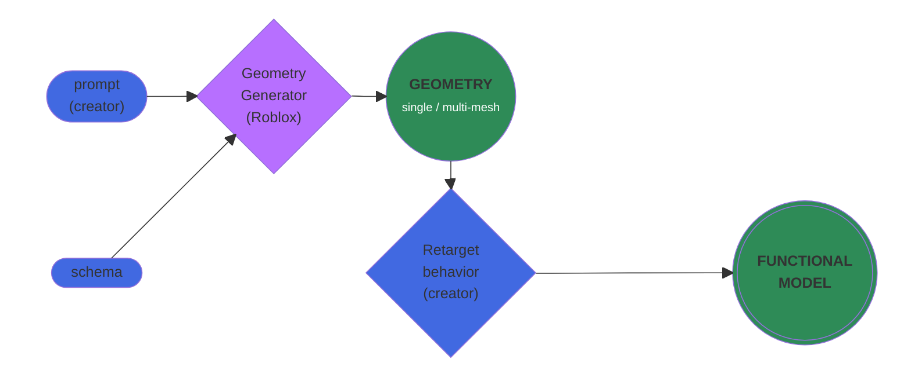

Through text prompts and preset schemas, you (and players in‑experience) can generate both static 3D assets and **fully functional** models such as vehicles that drive, planes that fly, and weapons that shoot. This guide demonstrates how to use `Class.GenerationService:GenerateModelAsync()|GenerateModelAsync()` as part of a dynamic, player‑driven creative experience.

## Overview

`Class.GenerationService:GenerateModelAsync()|GenerateModelAsync()` enables generation of multi‑mesh geometries with the following advantages:

- The provided [schema](#schema-based-generation) defines how the generated geometry will be broken into parts.
- Any object generated in-experience will be replicated and visible to all players, allowing them to build together in real‑time.
- Generated meshes are higher fidelity with better overall forms, silhouettes, more detail, and fewer artifacts. Generated textures are more coherent and detailed, with less graininess and less pronounced baked‑in lighting.
- Generation times have lower latency, enabling quicker and more responsive creation in experiences.
- You and even players during gametime can specify bounding boxes to suggest size and proportions of the generated model.
- An optional max triangle count keeps generated objects performant for your experience.

## Schema-based generation

To create articulated, functional objects, the generated geometry must be separated into multiple `Class.MeshPart|MeshParts`. For example, to create a drivable car with wheels that spin and steer, at least five `Class.MeshPart|MeshParts` are needed: one for the car body and four for each of the car's wheels. `Class.GenerationService:GenerateModelAsync()|GenerateModelAsync()` achieves this through a preset **schema** as shown in the following code snippet:

```lua title="Script in ServerScriptService"
local GenerationService = game:GetService("GenerationService")
local Workspace = game:GetService("Workspace")

-- Set up inputs for the generated geometry
local inputs = {
	TextPrompt = "green dragon car with 4 wheels"
}
-- Set schema to the predefined five-model car chassis
local schema = {
	PredefinedSchema = "Car5"
}

-- Make the call to generate the model
local success, result, metadata = pcall(function()
	return GenerationService:GenerateModelAsync(inputs, schema)
end)
if success then
	-- Scale model to target size and position near world center
	local targetSize = 16
	local modelSize = result:GetExtentsSize()
	local scaleFactor = targetSize / math.max(modelSize.X, modelSize.Y, modelSize.Z)
	result:ScaleTo(scaleFactor)
	result:PivotTo(CFrame.new(0, result:GetExtentsSize().Y / 2, -40))

	-- Anchor all parts so that the meshes don't fall apart
	for _, descendant in result:GetDescendants() do
		if descendant:IsA("BasePart") then
			descendant.Anchored = true
		end
	end

	-- Name the model and parent it to workspace
	result.Name = "BasicDragonCarGeneration"
	result.Parent = Workspace
else
	warn(result)
end
```

<Alert severity="success">
`Class.GenerationService:GenerateModelAsync()|GenerateModelAsync()` currently supports two fixed schemas: `Car5` which produces a car with a body and four wheels, and `Body1` which yields a single `Class.MeshPart` object. Additional schemas will be supported in the future, as well as creator‑customized (open) schemas.
</Alert>

The following image shows the expected output and its construction as it appears in the [Explorer](../studio/explorer.md) hierarchy:

<Grid container spacing={3}>
<Grid item Small={12} Medium={12} Large={6} XLarge={6}>

</Grid>
<Grid item Small={12} Medium={12} Large={5} XLarge={5}>

</Grid>
</Grid>

## Retargetable scripts

In Roblox, **behaviors** typically encompass the scripts, attachments, [constraints](../physics/index.md#constraints), and other instance types attached to static textured geometries to make them functional. Since `Class.GenerationService:GenerateModelAsync()|GenerateModelAsync()` generates a wide range of geometries on‑the‑fly, **retargetable scripts** must be attached to automatically adapt behaviors to expected functionality.

For example, consider an experience where players get to make their own drivable cars. `Class.GenerationService:GenerateModelAsync()|GenerateModelAsync()` takes the player prompt and generates five distinct meshes (body and four wheels) via the `Car5` [schema](#schema-based-generation). Then, a preset retargetable script adapts its driving behavior to the size and shape of the model to ensure the car is drivable and its wheels spin realistically.



To test retargetable scripts:

1. Download the <a href="../assets/modeling/model-generation/Behaviors.rbxm">`Behaviors.rbxm`</a> file.
2. In Studio's [Explorer](../studio/explorer.md) hierarchy, right‑click `Class.ReplicatedStorage`, select **Insert**&nbsp;⟩ **Import&nbsp;Roblox&nbsp;Model**, and choose the downloaded file. The model unpacks into several folders.

   

3. Copy and paste one of the following code snippets into a server `Class.Script` within `Class.ServerScriptService`, depending on the object type you'd like to generate.

   <Tabs>
   <TabItem label="Car">
   This example generates a functional car with a brake, nitro boost, audio and visual effects, and an on‑screen UI speedometer.

		```lua title="Script in ServerScriptService"
		local GenerationService = game:GetService("GenerationService")
		local ReplicatedStorage = game:GetService("ReplicatedStorage")
		local Workspace = game:GetService("Workspace")

		-- Set up inputs for the generated geometry
		local inputs = {
			TextPrompt = "green dragon car with 4 wheels"
		}
		-- Set schema to the predefined five-model car chassis
		local schema = {
			PredefinedSchema = "Car5"
		}

		-- Make the call to generate the model
		local success, result, metadata = pcall(function()
			return GenerationService:GenerateModelAsync(inputs, schema)
		end)
		if success then
			-- Scale model to target size
			local targetSize = 16
			local modelSize = result:GetExtentsSize()
			local scaleFactor = targetSize / math.max(modelSize.X, modelSize.Y, modelSize.Z)
			result:ScaleTo(scaleFactor)

			-- Load "makeFunctional" module for "CarBehavior"
			local makeFunctional = require(ReplicatedStorage.Behaviors.CarBehavior.makeFunctional)

			-- Reference car parts by names guaranteed through the "Car5" schema
			local body = result:FindFirstChild("body")
			local frontLeftWheel = result:FindFirstChild("front left wheel")
			local frontRightWheel = result:FindFirstChild("front right wheel")
			local rearLeftWheel = result:FindFirstChild("rear left wheel")
			local rearRightWheel = result:FindFirstChild("rear right wheel")

			-- Set behavioral configuration parameters
			local config = {
				seatPosition = "inside",
				invisibleWhenSeated = false
			}

			-- Attach behavior via the "makeFunctional" script
			local functionalModel = makeFunctional(result, frontLeftWheel, frontRightWheel, rearLeftWheel, rearRightWheel, body, config)

			-- Position the model near world center
			functionalModel:PivotTo(CFrame.new(0, functionalModel:GetExtentsSize().Y / 2, -40))
			functionalModel.Name = "BasicDragonCarGeneration"
			functionalModel.Parent = Workspace
		else
			warn(result)
		end
		```

   <video src="../assets/modeling/model-generation/Green-Dragon-Car-Driving.mp4" controls width="90%"></video>

   <Alert severity="success">
   To test other generated models with retargetable scripts in the `Car5` schema, change the `TextPrompt` string value on line&nbsp;7 and playtest again. Ideas include:
	 
      - `"yellow sports car with a spoiler"`
      - `"purple bat car with 4 wheels"`
      - `"giant monster truck with spiked roof"`
	 </Alert>

   </TabItem>
   <TabItem label="Airplane">
   This example generates a basic plane using the `Body1` schema that flies through player input.

		```lua title="Script in ServerScriptService"
		local GenerationService = game:GetService("GenerationService")
		local ReplicatedStorage = game:GetService("ReplicatedStorage")
		local Workspace = game:GetService("Workspace")

		-- Set up inputs for the generated geometry
		local inputs = {
			TextPrompt = "basic paper airplane with two wings"
		}
		-- Set schema to the predefined static body
		local schema = {
			PredefinedSchema = "Body1"
		}

		-- Make the call to generate the model
		local success, result, metadata = pcall(function()
			return GenerationService:GenerateModelAsync(inputs, schema)
		end)
		if success then
			-- Scale model to target size
			local targetSize = 30
			local modelSize = result:GetExtentsSize()
			local scaleFactor = targetSize / math.max(modelSize.X, modelSize.Y, modelSize.Z)
			result:ScaleTo(scaleFactor)
			
			-- Load "makeFunctional" module for "AirplaneBehavior"
			local makeFunctional = require(ReplicatedStorage.Behaviors.AirplaneBehavior.makeFunctional)
			
			-- Set behavioral configuration parameters
			local config = {
				seatPosition = "ontop",
				forwardSpeed = 80,
				turnSpeed = 8
			}
			
			-- Attach behavior via the "makeFunctional" script
			local functionalModel = makeFunctional(result, config)
			
			-- Place model slightly above ground to let it fall into place
			local boundingBox = functionalModel:GetBoundingBox()
			local location = Vector3.new(0, boundingBox.Y / 2 + 3, -40)
			functionalModel:PivotTo(CFrame.new(location))
			functionalModel.Name = "BasicPlaneGeneration"
			functionalModel.Parent = Workspace
		else
			warn(result)
		end
		```

   </TabItem>
   </Tabs>
