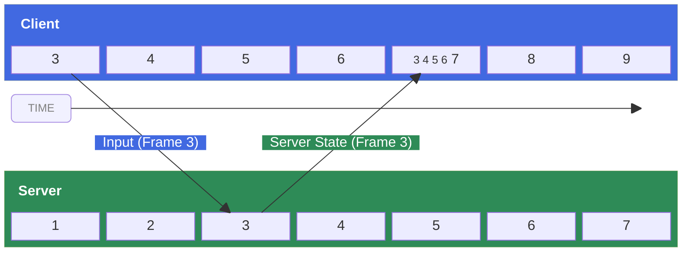

import BetaAlert from '../../includes/beta-features/beta-alert.md'

<BetaAlert betaName="Server Authority Core API" leadIn="The server authority model and its associated APIs are currently in beta. Enable them in Studio through " leadOut="." components={props.components} />

<Alert severity="error">
As this feature is currently in beta, you should **not** publish a server‑authoritative experience. Your players' clients will not yet have support for server authority APIs, so the published experience will not work correctly.
</Alert>

In a **server authority model**, the server is the single **source of truth** for the entire experience state, and clients are only trusted to report their own inputs. This architecture is the core netcode foundation of a fair, competitive experience because it prevents entire classes of cheating like flyhacks or speedhacks by never trusting a client to report its own position or state.

## Advantages

In a naive server-owned system, clients would simply send their inputs to the server and display the results of the experience sent back by the server. While technically correct, such a system would face significant **input latency** because every player action would have to travel to the server, be processed, and have the result sent back to the client before it could be displayed. For most experiences, especially those fast‑paced, that round‑trip delay would cause gameplay to feel laggy, unresponsive, and unplayable.

In Roblox's **server authority** model, latency is compensated for by having clients instantly [predict](#client-prediction) the effects of their inputs in addition to sending them to the server. For example, when a player presses a key, the client doesn't wait for the server to respond; instead it **predicts** a few frames ahead of the last known server state. This allows the client to show the result of the input action instantly, effectively hiding network latency and making the experience feel responsive.

Sometimes the client will get its prediction wrong ([misprediction](#client-misprediction)) and, because of network latency, the client will not know that it has made a mistake for a few frames. For example:

<Alert severity="warning" variant="outlined">
Your client predicts that you've moved forward, but on the server another player used a stun ability that stopped you from moving. The client and server now have different states.
</Alert>

When a misprediction is detected, the client must correct its prediction based on the server's **authoritative state**. If the authoritative state is different from the client's predicted state, the client must [roll back and resimulate](#rollback-and-resimulation) its predicted frames. This system of client‑side prediction, rollback, and resimulation is known as "latency&nbsp;compensation" and helps make server‑authoritative multiplayer experiences feel smooth and responsive.

<Alert severity="info">
Mispredictions are a **normal and expected** part of the server authority architecture because clients inherently cannot predict other players' inputs, so actions by other players will always trigger some amount of misprediction. When tuned correctly, the resulting corrections are small and should be imperceptible to players. Read further on [advanced techniques](./techniques.md) to smooth out and mask network artifacts.
</Alert>

## Setup

As the server authority model requires certain other engine technologies to function correctly, you must first set the following properties on the `Class.Workspace` object in the [Explorer](../../studio/explorer.md):

1. `Class.Workspace.NextGenerationReplication` must be enabled
2. `Class.Workspace.PlayerScriptsUseInputActionSystem` must be enabled
3. `Class.Workspace.SignalBehavior` must be `Enum.SignalBehavior.Deferred|Deferred`
4. `Class.Workspace.UseFixedSimulation` must be enabled
5. `Class.Workspace.StreamingEnabled` must be enabled
6. `Class.Workspace.AuthorityMode` must be `Enum.AuthorityMode.Server|Server` (all of the above must be set first)

## Concepts

The server authority system runs on a few core concepts as follows.

### Client prediction

Through **client prediction**, the client simulates a few frames ahead of the last known server state to predict the effects of player inputs immediately. This hides input latency, but the prediction may later turn out to be incorrect ([client misprediction](#client-misprediction)) and thus require correction. The client tries to simulate just far enough ahead of the last known authoritative server state so that its inputs arrive on the server at the intended frame. The number of frames the client will predict ahead of the known server state is based on the latency behind the client and server.

### Client misprediction

When the client receives the authoritative state from the server, it checks that state against a historical record of what it predicted locally for that frame. When there is a difference between what the client [predicted](#client-prediction) and what the server actually did, this is a **misprediction**. Mispredictions can occur for several reasons, including shifts in network latency, other players acting in ways the client didn't anticipate, the experience running certain logic exclusively on the server, etc.

If the authoritative state is different from the client's predicted state, the client must [roll back and resimulate](#rollback-and-resimulation).

### Rollback and resimulation

When a client detects a [misprediction](#client-misprediction), it must reset to the server's authoritative state and then resimulate to jump back to its predicted frame. Based on the network latency, the client tries to simulate just far enough ahead of the last known authoritative server state so that its inputs arrive on the server at the intended frame.



<figure>
<figcaption>In the above diagram, the client is simulating 2 frames ahead of the server. It sends its inputs for frame 3 which arrive at the intended frame (3) on the server. The server sends the authoritative state for frame 3 and the client receives it on frame 7. The client discovers it mispredicted frame 3 so it resets to the server's frame 3 and resimulates frames 4, 5 and 6 before it simulates frame 7. Players may see a noticeable network artifact such as a sudden movement.</figcaption>
</figure>

In summary, the **client**:

1. Receives the **authoritative state** from the server and compares it against its own **predicted state**.
2. If the client's prediction was incorrect:
   1. Client rolls back to the last known authoritative state received from the server.
   2. Client resimulates from the authoritative state to its predicted state, re-applying any local inputs.

## Implementation

### Network ownership and prediction

In the server authority model, you're able to keep the core gameplay objects server‑owned without incurring the input latency cost normally associated with server ownership. Things like cars, player characters, or other gameplay‑critical objects can remain server‑owned, even when interacting with other players.

By default, Roblox will automatically predict the physics properties of `Class.BasePart|BaseParts` near the local player `Class.Player.Character|Character`, but if you want more fine‑grained control, you can explicitly force an instance's prediction on or off with `Class.RunService:SetPredictionMode()`.

<Alert severity="success">
Roblox synchronizes all relevant physics properties automatically.
</Alert>

### Simulation sync

In the server authority model, the client and the server must both run the core simulation, and the client's simulation needs to be able to [roll back and resimulate](#rollback-and-resimulation) when a [misprediction](#client-misprediction) occurs. To enable this, write your core logic inside functions bound through `Class.RunService:BindToSimulation()` in a `Class.ModuleScript` that's initialized on both the client and server.


```lua title="Simulation (ModuleScript)"
local RunService = game:GetService("RunService")
local Players = game:GetService("Players")

local Simulation = {}

Simulation.Initialize = function()
	RunService:BindToSimulation(function(deltaTime)
		-- Read player inputs
		-- Update experience state
	end)
end

return Simulation
```

```lua title="ServerLoader (Server Script)"
local Simulation = require(script.Parent)

Simulation:Initialize()
```

```lua title="ClientLoader (Client Script)"
local Simulation = require(script.Parent)

Simulation:Initialize()
```

During a resimulation, Roblox will re-run the functions bound to the simulation via `Class.RunService:BindToSimulation()|BindToSimulation()`. Processing player inputs, interacting with synchronized physics objects, and updating the core experience state should live inside those bound functions.

### State sync with attributes

Roblox automatically synchronizes all relevant physics properties on predicted instances. For custom data, [attributes](../../studio/properties.md#instance-attributes) are the primary way to synchronize instances marked as predicted; on such instances, any mismatch in attribute values between the server's source of truth and the client's prediction will trigger a full [rollback and resimulation](#rollback-and-resimulation).

<Alert severity="success">
Use attributes to store experience data that affects your core simulation, including player health, ammunition, inventory, or custom rules (see [limitations](#attribute-limits)).
</Alert>

<Alert severity="warning">
Only write to attributes on **predicted** instances from within functions bound through `Class.RunService:BindToSimulation()|BindToSimulation()` to ensure that Roblox can fully track relevant experience states and resimulate properly.
</Alert>

#### Attribute limits

In order to be replicated, an attribute must meet all of the following criteria:

- It is among the first 64 attributes on its `Class.Instance`.
- Its name contains at most 50 characters.
- If a string type attribute, its value contains at most 50 characters.

#### Physical properties

The server authority system predicts physical properties such as the ones below. Note that this is **not** an exhaustive list but rather an illustration of classes and property types that will be considered.

- `Class.BasePart` — `Class.BasePart.CFrame|CFrame`; `Class.BasePart.RotVelocity|RotVelocity`; `Class.BasePart.Velocity|Velocity` (if assembly root); `Class.BasePart.CurrentPhysicalProperties|CurrentPhysicalProperties`; `Class.BasePart.CanCollide|CanCollide`; `Class.BasePart.Mass|Mass`; `Class.BasePart.Size|Size`
- `Class.WeldConstraint` — `Class.WeldConstraint.Enabled|Enabled`; `Class.WeldConstraint.CFrame1|CFrame1`; `Class.WeldConstraint.CFrame2|CFrame2`
- `Class.Constraint` — `Class.Constraint.Enabled|Enabled`; any non-redundant readable/writable property
- `Class.Attachment` — `Class.Attachment.CFrame|CFrame`
- `Class.Motor` — `Class.Motor.CurrentAngle|CurrentAngle`; `Class.Motor.DesiredAngle|DesiredAngle`; `Class.Motor.MaxVelocity|MaxVelocity`
- `Class.Humanoid` — `Class.Humanoid.Jump|Jump`; `Class.Humanoid.MoveDirection|MoveDirection`; `Class.Humanoid.AutoRotate|AutoRotate`
- `Class.ControllerManager`

### Input actions

In a server-authoritative experience, the primary way for a client to affect the experience's state is through the [Input Action System](../../input/input-action-system.md). These inputs are sent to the server and are replayed during resimulation on the client. As a result, `Class.InputAction|InputActions` should be used for **all inputs that affect the core  simulation** and they should be checked for sanity before they're processed.

<Alert severity="warning">
To reiterate, do not use traditional events like `Class.UserInputService.InputBegan` in the core simulation of a server-authoritative experience.
</Alert>

Note that `Class.InputContext|InputContexts` must be a descendent of a `Class.Player` so that the engine knows who has ownership over the `Class.InputContext`. Placement in `Class.StarterGui` is fine, since it replicates to the player's `Class.PlayerGui` at join time and effectively descends from that `Class.Player`.


Using this pattern, you can read `Class.InputAction|InputActions` for all players in `Class.RunService:BindToSimulation()` on both client and server to receive the same data for a given frame and record the previous frame's input in an [attribute](../../studio/properties.md#instance-attributes), for example to trigger a character sprint when a `CharacterSprint` input action is triggered.

Note that if you need to write custom data into the [Input Action System](../../input/input-action-system.md), you should use a function connected to `Class.RunService.RenderStepped` or `Class.RunService:BindToRenderStep()`, not `Class.RunService:BindToSimulation()`. Firing an `Class.InputAction` in `Class.RunService:BindToSimulation()|BindToSimulation()` can cause clients to produce incorrect results during a resimulation.

```lua
local Players = game:GetService("Players")
local RunService = game:GetService("RunService")
local Workspace = game:GetService("Workspace")

RunService:BindToRenderStep("CameraInput", Enum.RenderPriority.Last.Value, function()
	-- Send the client camera's forward vector to the server through an InputAction
	local cameraForwardInputAction = Players.LocalPlayer.PlayContext.CameraForward
	local cameraForwardVector = Workspace.CurrentCamera.CFrame.LookVector
	cameraForwardInputAction:Fire(cameraForwardVector)
end)
```

### Remote events

[Remote events](../../scripting/events/remote.md) can still be used within the server authority model to facilitate discrete communication between client and server. For example, servers can use remote events to broadcast data about players scoring points or picking up objects, and clients can use remote events as an alternative API for sending inputs to the server, such as for button presses or tapping objects in the 3D world.

### Animations, sounds, and effects

Client-side effects like animations and sounds must be written knowing that the client simulation is merely a prediction of the authoritative server state. `Class.RunService:BindToSimulation()|BindToSimulation()` limits what properties and methods can be called from within bound functions to help guide you in writing only to the synchronized simulation state. Displaying the results of this simulation, triggering effects and sounds, etc. should be done in a separate function connected to `Class.RunService.RenderStepped|RenderStepped` that reads the results of the simulation and triggers the desired effects.

Further guidance around rendering a predicted simulation is covered in the [advanced techniques](./techniques.md) guide.

## Example projects

In addition to this documentation, the following templates can help you get started:

<GridContainer numColumns="3">
  <figure>
    <a href="https://www.roblox.com/games/134686834388911/Racing-Server-Authority-Template"></a>
    <figcaption>Racing</figcaption>
  </figure>
	<figure>
    <a href="https://www.roblox.com/games/110687099504272/Soccer-Server-Authority-Template"></a>
    <figcaption>Soccer</figcaption>
  </figure>
	<figure>
    <a href="https://www.roblox.com/games/90572444221193/Laser-Tag-Server-Authority-Template"></a>
    <figcaption>Laser Tag</figcaption>
  </figure>
</GridContainer>
