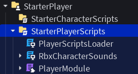

By default, Roblox creates default scripts that provide behavior for things such as the Camera and Character Controls.

<figure>

</figure>

By starting a playtest <kbd>F5</kbd>, you can find the inserted scripts and copy them through the Explorer, and then stop the playtest and paste the scripts in, in order to optionally modify them, if preferred.
